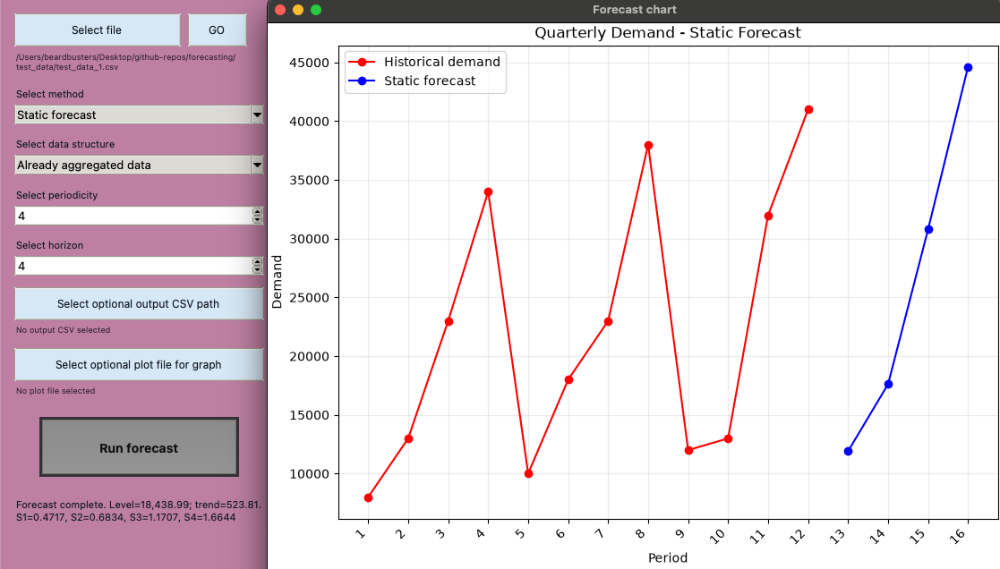

# Quarterly Demand Forecasting

A local Python application for importing CSV data, preparing quarterly demand,
and producing a static trend-and-seasonality forecast. Use the Tkinter desktop
interface for an interactive workflow or the command line for repeatable runs.

> [!NOTE]
> This project is currently a proof of concept. Static forecasting is the first
> implemented method; additional forecasting methods are planned.

## Features

- Import CSV files into pandas DataFrames.
- Preview source data and select the columns used for forecasting.
- Work with already-aggregated demand or raw transaction data.
- Aggregate raw transactions into continuous calendar quarters.
- Keep refunds and cancellations in net quarterly totals by default.
- Calculate a static forecast using level, trend, and seasonal factors.
- Display historical demand in red and forecast values in blue.
- Open every completed forecast in an interactive Matplotlib window.
- Optionally export the complete forecast DataFrame and chart.
- Inspect and forecast aggregated CSV files from the CLI.

## Requirements

- Python 3.12 or newer is recommended.
- A Python installation with Tkinter/Tcl-Tk support is required for the GUI.
- Git is optional but recommended for cloning the repository.

You can verify that Tkinter is available before installing the project:

```bash
python3 -m tkinter
```

If a small demonstration window opens, Tkinter is working. If the command fails,
install a Python distribution that includes Tcl/Tk support before running the
GUI. The CLI does not require a display.

## Installation

Clone the repository and enter the project directory:

```bash
git clone https://github.com/nairolfs42/forecasting.git
cd forecasting
```

### macOS or Linux

Create a local virtual environment and install the dependencies:

```bash
source ./setup.sh
```

### Windows PowerShell

```powershell
py -3.12 -m venv .venv
.venv\Scripts\Activate.ps1
python -m pip install --upgrade pip
python -m pip install -r requirements.txt
```

If `py -3.12` is unavailable but Python 3 is installed, use `py -3` instead.


## Basic GUI usage

Activate the virtual environment, then launch the desktop application:

```bash
python main_gui.py
```

Use the application as follows:

1. Select a CSV file. The source DataFrame appears in the table.
2. Choose **Static forecast** as the method.
3. Choose whether the CSV contains **Already aggregated data** or
   **Raw transaction data**.
4. Select the requested period/date and demand/amount columns.
5. Set the periodicity and forecast horizon. Quarterly seasonality normally
   uses a periodicity of `4`.
6. Optionally select an output CSV path and PNG path.
7. Select **Run forecast**.
8. Review the forecast DataFrame and the interactive chart window.

The horizon is the number of future periods to generate. For example, a horizon
of `4` produces four future quarterly estimates.


A basic sample you could run would be a static forecast on test_data_1.csv with a horizon of 4
and periodicity of 4 to get another years forecast on the sample quarterly data. 



### Already aggregated data

Use this mode when each CSV row already represents one period, such as one row
per quarter.

- Select the demand column.
- Select a period column when meaningful labels or sorting are needed.
- Otherwise, use CSV row order and the application will generate periods
  `1, 2, 3, ...`.
- Demand must be numeric, non-missing, and non-negative.

Example:

```csv
quarter,demand
2023Q1,8000
2023Q2,13000
2023Q3,23000
2023Q4,34000
```

### Raw transaction data

Use this GUI mode when each row represents an individual transaction.

- Select the transaction date column.
- Select the transaction amount column.
- Dates are converted into calendar quarters.
- Missing quarters between the first and last transaction are inserted with
  zero demand.
- Negative transactions are included in net quarterly totals by default.

Example:

```csv
transaction_date,transaction_amount
2023-01-15,250.00
2023-02-02,175.50
2023-02-18,-25.00
2023-04-07,310.00
```

Raw mode also provides a **Set negatives to zero** override. Selecting it causes
the program to report the number and total value of negative transactions and
request confirmation. This produces gross totals, ignores refunds or
cancellations, and can overforecast net demand.

## Data requirements

- CSV headers must be unique. Surrounding whitespace in headers is removed.
- The selected demand or amount column must contain numeric values.
- Currency symbols, thousands separators, and parenthesized negatives can be
  parsed from text values.
- Selected period values must be non-missing and unique.
- A static forecast requires at least two seasonal cycles. Quarterly data with
  periodicity `4` therefore requires at least eight quarters.
- Raw transaction dates must be present and parseable.
- Net raw aggregation must not result in a negative quarterly total.

## CLI usage

The CLI currently supports already-aggregated period/demand CSV files. Raw
transaction aggregation and its negative-value controls are currently available
through the GUI.

Display all CLI options:

```bash
python main.py -h
```

### Inspect a CSV

Run the command with only a CSV path to print a profile of every available
column, including its data type, missing values, numeric percentage, and sample
values:

```bash
python main.py test_data/test_data_1.csv
```

Use this profile to identify the period and demand column names.

### Run a quarterly static forecast

The repository includes `test_data/test_data_1.csv`, whose relevant columns are
`period_t` and `demand_dt`:

```bash
python main.py test_data/test_data_1.csv \
  --period-column period_t \
  --demand-column demand_dt
```

The result, estimated level, trend, and seasonal factors are printed to the
terminal.

### Save forecast data and a chart

```bash
python main.py test_data/test_data_1.csv \
  --period-column period_t \
  --demand-column demand_dt \
  --periodicity 4 \
  --horizon 4 \
  --output output/static_forecast.csv \
  --plot output/static_forecast.png
```

The output directories are created automatically when necessary.

### CLI options

| Argument | Required | Description |
| --- | --- | --- |
| `csv_path` | Yes | Path to the source CSV file. |
| `--period-column` | For forecasting | Column containing unique ordered period values. |
| `--demand-column` | For forecasting | Column containing numeric, non-negative demand. |
| `--periodicity` | No | Periods per seasonal cycle; defaults to `4`. |
| `--horizon` | No | Future periods to forecast; defaults to `4`. |
| `--output` | No | Destination for the forecast DataFrame as CSV. |
| `--plot` | No | Destination for the red/blue forecast chart as PNG. |

If either forecasting column is omitted, the command only profiles the source
CSV and exits without fitting a model.

## Forecast calculation

The static method combines a linear trend with multiplicative seasonal factors:

1. Calculate a centered moving average to estimate deseasonalized demand.
2. Fit `demand = level + trend × period` with least squares.
3. Divide historical demand by trend demand to calculate seasonal ratios.
4. Average ratios for each season to estimate seasonal factors.
5. Multiply future trend demand by the appropriate seasonal factor.

This is a fixed historical fit: its parameters do not update recursively as new
forecast periods are generated.

## Forecast output

| Column | Meaning |
| --- | --- |
| `period` | Original historical label or generated future period. |
| `t` | Sequential numeric time index used by the model. |
| `season` | Position within the selected seasonal cycle. |
| `demand` | Observed demand; blank for future rows. |
| `deseasonalized_demand` | Centered moving-average estimate used to fit trend. |
| `trend_demand` | Demand predicted by the fitted linear trend. |
| `seasonal_ratio` | Historical demand divided by trend demand. |
| `seasonal_factor` | Average seasonal adjustment for that season. |
| `static_estimate` | Trend demand multiplied by the seasonal factor. |
| `row_type` | Identifies `historical` and `forecast` rows. |

## Libraries used

| Library | Version in this project | Purpose |
| --- | --- | --- |
| [pandas](https://pandas.pydata.org/docs/) | `>=2.2,<4` | CSV loading, DataFrames, cleaning, numeric conversion, and quarterly periods. |
| [NumPy](https://numpy.org/doc/stable/) | `>=2.0,<3` | Numeric arrays and least-squares trend estimation. |
| [Matplotlib](https://matplotlib.org/stable/) | `>=3.9,<4` | Interactive and saved forecast charts. |
| [Tkinter/ttk](https://docs.python.org/3/library/tkinter.html) | Python standard library | Local desktop interface, dialogs, tables, and chart windows. |
| [`argparse`](https://docs.python.org/3/library/argparse.html) | Python standard library | CLI argument parsing and help output. |
| [`venv`](https://docs.python.org/3/library/venv.html) | Python standard library | Isolated local dependency environment. |
| [`unittest`](https://docs.python.org/3/library/unittest.html) | Python standard library | Automated test suite. |

TensorFlow, Keras, and Seaborn are candidates for future forecasting and
visualization work; they are not current runtime dependencies.

## Run the tests

From the repository root with the virtual environment active:

```bash
python -m unittest discover -s tests -v
```

## Project structure

```text
forecasting/
├── main.py                       # CLI entry point
├── main_gui.py                   # Tkinter entry point
├── requirements.txt              # Third-party dependencies
├── setup.sh                      # macOS/Linux setup helper
├── src/
│   ├── algorithms/
│   │   ├── algo_helpers.py       # Moving average and trend calculations
│   │   └── forecasts.py          # Static forecast model
│   ├── data/
│   │   ├── data_parser.py        # CSV validation and quarterly aggregation
│   │   └── plotting.py           # Forecast figure creation
│   └── ui/
│       ├── app.py                # Main application window
│       ├── chart_window.py       # Interactive Matplotlib window
│       ├── data_table.py         # DataFrame table preview
│       └── state.py              # GUI application state
├── test_data/                    # Example CSV data
└── tests/                        # Automated tests
```

## Troubleshooting

### The activation script produces a Python syntax error

The activation file is a shell script, not a Python program. Use:

```bash
source .venv/bin/activate
```

Do not run `python .venv/bin/activate`.

### Tkinter cannot be imported

Run `python -m tkinter`. If it fails, install or reinstall Python with Tcl/Tk
support. Recreate `.venv` afterward so it uses the correct Python installation.

### The forecast says there is not enough data

Provide at least two seasonal cycles' worth of observations. With quarterly
periodicity `4`, use at least eight quarterly observations.

### The demand column is rejected

Check for blank, non-numeric, or negative values. For transaction-level data,
use **Raw transaction data** in the GUI so refunds can be netted into quarterly
totals or handled with the acknowledged zero-conversion override.
